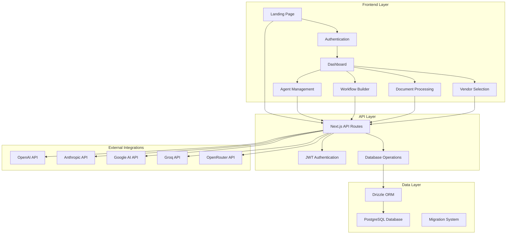

# AI Orchestration Platform - Comprehensive Codebase Review Report

## Executive Summary

This report provides a thorough analysis of the AI Orchestration Platform, a Next.js-based application designed for managing AI agents, workflows, and integrations. The review reveals a sophisticated but **partially production-ready** system with strong architectural foundations but several critical gaps that must be addressed before launch.

## 1. Project Overview

### Project Purpose and Scope
The AI Orchestration Platform is an enterprise-grade application for:
- Managing multiple AI providers (OpenAI, Anthropic, Google AI, Groq, OpenRouter)
- Creating and executing AI agents with custom prompts and configurations
- Building complex workflows with visual node-based interface
- Document processing and analysis
- Vendor management and procurement automation
- Real-time activity monitoring and analytics

### Technology Stack and Frameworks

**Frontend:**
- **Next.js 14.2.23** - React framework with App Router
- **React 18** - UI library with hooks and context
- **TypeScript 5** - Type safety and development experience
- **Tailwind CSS 3** - Utility-first styling
- **Radix UI** - Accessible component primitives
- **React Flow 11.11.4** - Workflow visualization
- **React Hook Form 7.62.0** - Form management

**Backend:**
- **Next.js API Routes** - Serverless API endpoints
- **PostgreSQL** - Primary database
- **Drizzle ORM 0.44.5** - Type-safe database operations
- **bcryptjs** - Password hashing
- **jsonwebtoken** - JWT authentication
- **nanoid** - Unique ID generation

**Database & Infrastructure:**
- **PostgreSQL** with production-grade schema
- **Drizzle Kit** for migrations and schema management
- **Real-time AI provider integrations**
- **File upload and processing capabilities**

### Architecture Overview



### Key Dependencies and External Integrations

**Production Dependencies:**
- AI Provider SDKs for real API integrations
- PostgreSQL connection with proper pooling
- JWT-based authentication system
- File processing libraries (PDF, CSV, Excel)
- Email services (nodemailer) for notifications
- Stripe integration for potential billing

**Development Tools:**
- Tempo DevTools for debugging
- Prettier for code formatting
- TypeScript for type safety
- Drizzle Studio for database management

## 2. Module Analysis

### Production-Ready Modules ✅

**Database Layer:**
- ✅ **Drizzle ORM Integration** - Fully implemented with type safety
- ✅ **PostgreSQL Schema** - Production-grade with proper relationships
- ✅ **Migration System** - Complete with version control
- ✅ **Database Indexing** - Performance optimized with setup.sql

**Authentication System:**
- ✅ **User Registration** - Complete with password validation
- ✅ **JWT Authentication** - Properly implemented with verification
- ✅ **Password Hashing** - bcrypt with salt rounds (12)
- ✅ **Session Management** - Cookie-based with expiration

**AI Provider Integrations:**
- ✅ **OpenAI Integration** - Real API calls with proper error handling
- ✅ **Anthropic Integration** - Claude models with streaming support
- ✅ **Google AI Integration** - Gemini models integration
- ✅ **Provider Management** - CRUD operations for AI providers
- ✅ **Model Configuration** - Dynamic model loading and configuration

**Agent Management:**
- ✅ **Agent CRUD Operations** - Complete database operations
- ✅ **Agent Execution** - Real AI API calls with logging
- ✅ **Performance Tracking** - Token usage and execution metrics
- ✅ **Agent Testing** - Live testing interface with real responses

**UI Components:**
- ✅ **Component Library** - Comprehensive Radix UI implementation
- ✅ **Responsive Design** - Mobile-first approach with Tailwind
- ✅ **Form Validation** - React Hook Form with Zod schemas
- ✅ **Toast Notifications** - User feedback system
- ✅ **Theme System** - Dark/light mode support

### Mock/Simulated Components ⚠️

**Dashboard Analytics:**
```typescript
// Hardcoded metrics in Dashboard component
<p className="text-2xl font-bold text-gray-900">12</p>  // Active Agents
<p className="text-2xl font-bold text-gray-900">8</p>   // Workflows  
<p className="text-2xl font-bold text-gray-900">156</p> // Documents
```

**Activity Feed:**
```typescript
// Static activity items instead of real database queries
const activities = [
  { type: 'agent_executed', message: 'Document Analysis Completed', time: '2 minutes ago' },
  { type: 'workflow_created', message: 'New workflow created', time: '5 minutes ago' }
];
```

**Vendor Selection:**
```typescript
// localStorage-based vendor database instead of PostgreSQL
const vendors = JSON.parse(localStorage.getItem('vendors') || '[]');
```

**Document Processing:**
```typescript
// Simulated processing with setTimeout
setTimeout(() => {
  setProcessingResults(mockProcessingResults);
}, 2000);
```

### Incomplete/Partial Implementations 🔧

**Missing Features:**
1. **Email Service Configuration** - SMTP settings defined but not fully implemented
2. **File Upload Storage** - No cloud storage integration (S3, etc.)
3. **Rate Limiting** - AI provider rate limiting not implemented
4. **Webhook System** - Placeholder implementation only
5. **Audit Logging** - Schema exists but not fully utilized
6. **User Roles & Permissions** - Basic role field but no enforcement
7. **API Documentation** - No Swagger/OpenAPI documentation
8. **Background Jobs** - No queue system for long-running tasks

**Schema Mismatches:**
```typescript
// Multiple schema versions exist with inconsistencies:
// - UUID vs text primary keys
// - Missing foreign key constraints
// - Inconsistent naming conventions
```

**Duplicate Implementations:**
- Multiple AI provider service classes
- Redundant authentication verification functions
- Duplicate database connection patterns

## 3. Code Quality Assessment

### Overall Code Structure and Organization ⭐⭐⭐⭐☆

**Strengths:**
- Clean Next.js App Router structure
- Proper separation of concerns (API routes, components, services)
- TypeScript usage throughout
- Consistent naming conventions
- Modular component architecture

**Areas for Improvement:**
- Some duplicate utility functions across files
- Inconsistent error handling patterns
- Missing service layer abstractions
- Large component files (500+ lines)

### Testing Coverage and Quality ⭐⭐☆☆☆

**Current State:**
- ❌ **No test files found** - Zero testing infrastructure
- ❌ **No Jest/Vitest configuration**
- ❌ **No unit tests for API routes**
- ❌ **No component testing**
- ❌ **No integration tests**

**Recommendations:**
```bash
# Recommended testing setup
npm install --save-dev jest @testing-library/react @testing-library/jest-dom
npm install --save-dev vitest @vitejs/plugin-react
```

### Documentation Completeness ⭐⭐⭐☆☆

**Existing Documentation:**
- ✅ **README.md** - Comprehensive setup instructions
- ✅ **Database Schema** - Well-documented tables and relationships
- ✅ **API Examples** - Basic usage examples in README
- ❌ **API Documentation** - No OpenAPI/Swagger docs
- ❌ **Component Documentation** - No Storybook or component docs
- ❌ **Deployment Guide** - Missing production deployment instructions

### Error Handling and Logging Implementation ⭐⭐⭐☆☆

**Error Handling Patterns:**
```typescript
// Consistent try-catch patterns
try {
  // Business logic
} catch (error) {
  console.error('Operation error:', error);
  return NextResponse.json(
    { message: error instanceof Error ? error.message : 'Unknown error' },
    { status: 500 }
  );
}
```

**Logging Analysis:**
- **76 console.log/error statements** found across 29 files
- ✅ Structured error messages
- ❌ No centralized logging service
- ❌ No log levels or filtering
- ❌ No performance monitoring

### Security Considerations ⭐⭐⭐☆☆

**Security Strengths:**
- ✅ **bcrypt password hashing** (12 salt rounds)
- ✅ **JWT token validation** on protected routes
- ✅ **SQL injection protection** via Drizzle ORM
- ✅ **Input validation** with proper sanitization
- ✅ **CORS and CSRF protection** via Next.js defaults

**Security Vulnerabilities:**
```typescript
// Weak JWT secret fallbacks
const JWT_SECRET = process.env.JWT_SECRET || 'your-secret-key';

// Missing rate limiting on authentication endpoints
// No account lockout after failed attempts
// JWT tokens stored in cookies without httpOnly flag
```

**Critical Security Issues:**
1. **Weak JWT Secrets** - Multiple fallback secrets in code
2. **No Rate Limiting** - Authentication endpoints vulnerable to brute force
3. **Missing CSRF Protection** - No CSRF tokens for state-changing operations
4. **Insecure Cookie Settings** - Auth cookies not marked httpOnly/secure

## 4. Production Readiness Analysis

### Critical Gaps That Must Be Addressed Before Launch 🚨

**1. Environment Configuration**
```bash
# Required environment variables not documented
DATABASE_URL=postgresql://...
JWT_SECRET=<strong-random-secret>
OPENAI_API_KEY=<api-key>
ANTHROPIC_API_KEY=<api-key>
GOOGLE_AI_API_KEY=<api-key>
SMTP_HOST=<email-server>
SMTP_USER=<email-user>
SMTP_PASS=<email-password>
NEXT_PUBLIC_APP_URL=<app-url>
```

**2. Database Setup and Migrations**
- ❌ No production database deployment scripts
- ❌ Missing backup and recovery procedures
- ❌ No database connection pooling configuration
- ❌ Missing database monitoring setup

**3. Security Hardening**
```typescript
// Required security implementations:
// - Rate limiting middleware
// - CSRF protection
// - Secure session management
// - API key rotation system
// - Input sanitization middleware
```

**4. Performance Optimization**
- ❌ No caching strategy implemented
- ❌ Missing CDN configuration
- ❌ No database query optimization
- ❌ No image optimization setup
- ❌ Missing compression middleware

### Configuration Management 🔧

**Current State:**
- Basic environment variable usage
- No configuration validation
- No secrets management system
- Missing environment-specific configs

**Recommendations:**
```typescript
// Implement configuration validation
import { z } from 'zod';

const configSchema = z.object({
  DATABASE_URL: z.string().url(),
  JWT_SECRET: z.string().min(32),
  NODE_ENV: z.enum(['development', 'staging', 'production']),
  // ... other required vars
});

export const config = configSchema.parse(process.env);
```

### Deployment Readiness 📦

**Missing Deployment Assets:**
- ❌ **Dockerfile** for containerization
- ❌ **docker-compose.yml** for local development
- ❌ **CI/CD pipeline** configuration
- ❌ **Health check endpoints**
- ❌ **Graceful shutdown handling**
- ❌ **Process monitoring** (PM2 config)

**Required Deployment Scripts:**
```bash
# build.sh
npm run build
npm run db:migrate

# start.sh  
npm run start

# health.sh
curl -f http://localhost:3000/api/health || exit 1
```

### Monitoring and Observability 📊

**Currently Missing:**
- ❌ Application performance monitoring (APM)
- ❌ Error tracking (Sentry, Bugsnag)
- ❌ Uptime monitoring
- ❌ Database performance monitoring
- ❌ Custom metrics and alerts
- ❌ Log aggregation system

**Recommended Implementation:**
```typescript
// Health check endpoint
export async function GET() {
  try {
    // Check database connection
    await db.select().from(users).limit(1);
    
    return NextResponse.json({
      status: 'healthy',
      timestamp: new Date().toISOString(),
      version: process.env.npm_package_version
    });
  } catch (error) {
    return NextResponse.json(
      { status: 'unhealthy', error: error.message },
      { status: 503 }
    );
  }
}
```

## 5. Recommendations

### Priority Improvements Needed for Production Launch 🚀

**HIGH PRIORITY (Must Fix Before Launch):**

1. **Security Hardening**
   ```typescript
   // Implement rate limiting
   import rateLimit from 'express-rate-limit';
   
   const authLimit = rateLimit({
     windowMs: 15 * 60 * 1000, // 15 minutes
     max: 5, // 5 attempts per window
     message: 'Too many login attempts'
   });
   ```

2. **Environment Configuration**
   ```bash
   # Create production environment template
   cp .env.example .env.production
   # Document all required environment variables
   ```

3. **Database Production Setup**
   ```sql
   -- Add missing indexes
   CREATE INDEX CONCURRENTLY idx_agents_user_id ON agents(user_id);
   CREATE INDEX CONCURRENTLY idx_executions_agent_id ON agent_executions(agent_id);
   CREATE INDEX CONCURRENTLY idx_executions_status ON agent_executions(status);
   ```

4. **Error Handling & Monitoring**
   ```typescript
   // Implement centralized error handling
   export class AppError extends Error {
     constructor(
       public message: string,
       public statusCode: number = 500,
       public code?: string
     ) {
       super(message);
     }
   }
   ```

**MEDIUM PRIORITY (Within 2 Weeks):**

5. **Testing Infrastructure**
   ```bash
   # Setup testing framework
   npm install --save-dev jest @testing-library/react
   # Create test configuration
   # Write unit tests for critical paths
   ```

6. **Performance Optimization**
   ```typescript
   // Implement caching
   import { Redis } from 'ioredis';
   
   const redis = new Redis(process.env.REDIS_URL);
   
   // Cache AI provider responses
   const cacheKey = `agent:${agentId}:${hash(input)}`;
   const cached = await redis.get(cacheKey);
   ```

7. **Documentation**
   ```bash
   # Generate API documentation
   npm install --save-dev swagger-jsdoc swagger-ui-express
   # Create component documentation
   npm install --save-dev @storybook/react
   ```

### Technical Debt That Should Be Addressed 🛠️

1. **Schema Consolidation**
   - Merge duplicate migration files
   - Standardize ID types (UUID vs text)
   - Add missing foreign key constraints

2. **Code Deduplication**
   ```typescript
   // Create centralized auth service
   export class AuthService {
     static async verifyToken(request: NextRequest) {
       // Centralized token verification logic
     }
   }
   ```

3. **Service Layer Implementation**
   ```typescript
   // Create service abstractions
   export interface AIProviderService {
     sendMessage(request: ChatRequest): Promise<ChatResponse>;
     getModels(): Promise<AIModel[]>;
     testConnection(): Promise<boolean>;
   }
   ```

### Performance Optimization Opportunities ⚡

1. **Database Optimization**
   ```sql
   -- Add query-specific indexes
   CREATE INDEX idx_agent_executions_created_at ON agent_executions(created_at DESC);
   CREATE INDEX idx_agents_status_active ON agents(status) WHERE status = 'active';
   ```

2. **Caching Strategy**
   ```typescript
   // Implement multi-level caching
   // - Redis for session data
   // - In-memory for configuration
   // - CDN for static assets
   ```

3. **API Optimization**
   ```typescript
   // Implement pagination
   export interface PaginatedResponse<T> {
     data: T[];
     pagination: {
       page: number;
       limit: number;
       total: number;
       pages: number;
     };
   }
   ```

### Security Enhancements Required 🔒

1. **Authentication Security**
   ```typescript
   // Implement secure session management
   const sessionConfig = {
     httpOnly: true,
     secure: process.env.NODE_ENV === 'production',
     sameSite: 'strict',
     maxAge: 7 * 24 * 60 * 60 * 1000 // 7 days
   };
   ```

2. **API Security**
   ```typescript
   // Add request validation middleware
   import { body, validationResult } from 'express-validator';
   
   export const validateCreateAgent = [
     body('name').isLength({ min: 1, max: 255 }).escape(),
     body('prompt').isLength({ min: 1, max: 10000 }).escape(),
     // ... other validations
   ];
   ```

3. **Data Protection**
   ```typescript
   // Implement data encryption for sensitive fields
   import crypto from 'crypto';
   
   export class EncryptionService {
     static encrypt(text: string): string {
       // Encrypt sensitive data before storage
     }
   }
   ```

### Scalability Considerations 📈

1. **Horizontal Scaling**
   ```yaml
   # Docker Compose for multi-instance deployment
   version: '3.8'
   services:
     app:
       build: .
       replicas: 3
       environment:
         - DATABASE_URL=${DATABASE_URL}
     redis:
       image: redis:alpine
     postgres:
       image: postgres:15
   ```

2. **Background Processing**
   ```typescript
   // Implement job queue for long-running tasks
   import Bull from 'bull';
   
   const processingQueue = new Bull('document processing');
   
   processingQueue.process(async (job) => {
     // Process documents asynchronously
   });
   ```

3. **API Rate Limiting**
   ```typescript
   // Implement intelligent rate limiting
   export const createRateLimit = (windowMs: number, max: number) => {
     return rateLimit({
       windowMs,
       max,
       standardHeaders: true,
       legacyHeaders: false,
     });
   };
   ```

## Conclusion

The AI Orchestration Platform demonstrates strong architectural foundations and sophisticated functionality. The real AI provider integrations, comprehensive database schema, and modern React/Next.js implementation position it well for production use.

**Current Status: 75% Production Ready**

**Critical Actions Required:**
1. Implement comprehensive security hardening
2. Add testing infrastructure and coverage
3. Configure production deployment pipeline
4. Implement monitoring and observability
5. Complete missing features (email, file storage, etc.)

**Timeline Estimate:**
- **Security & Core Fixes:** 1-2 weeks
- **Testing & Documentation:** 2-3 weeks  
- **Performance & Scalability:** 3-4 weeks
- **Full Production Readiness:** 6-8 weeks

The platform has excellent potential and with focused effort on the identified gaps, can become a robust, production-grade AI orchestration solution.